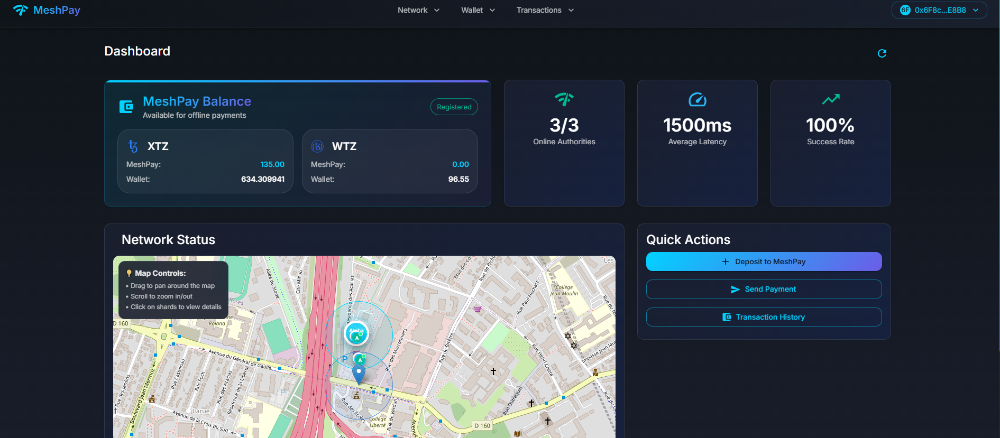
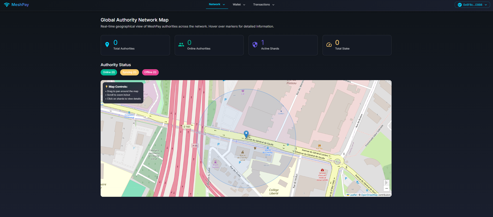
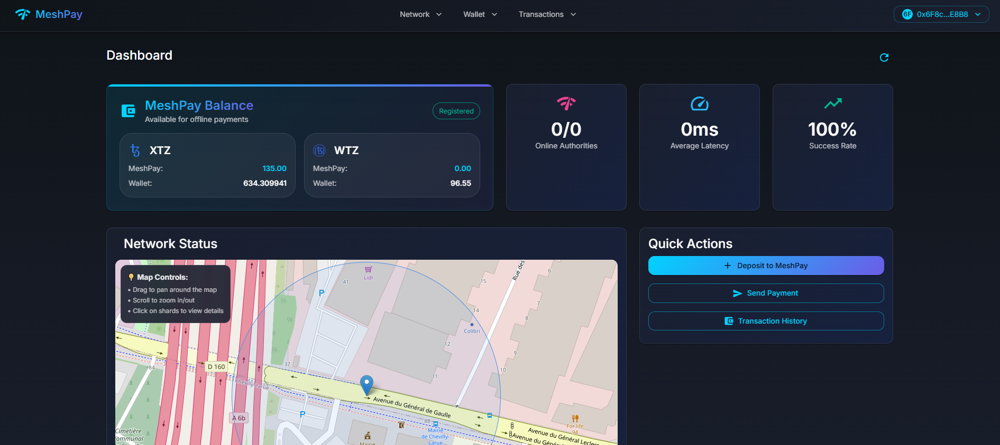

# MeshPay: Offline Blockchain Payments on Etherlink

> **Revolutionary offline payment system that enables USDT/USDC transfers without internet connectivity using local authority networks and Etherlink blockchain settlement.**

[](assets/meshpay-demo.mp4)
*Click to watch live demo video*

---

## 🌟 What Makes MeshPay Unique?

MeshPay represents a breakthrough in blockchain payments by solving the fundamental problem of **offline transactions**. Unlike traditional blockchain systems that require constant internet connectivity, MeshPay enables users to send stablecoin payments even when completely offline, using a network of local WiFi authorities for Byzantine fault-tolerant consensus.

---

## 🔗 Installation

```bash
# 1. Clone the repository
git clone <repository-url>
cd mininet-web

# 2. Start all services with Docker Compose
docker compose up -d

# 3. Access the application
# Web App: http://localhost:3000
# API Docs: http://localhost:8000/docs
# WebSocket: ws://localhost:8000/ws
```

### **Manual Setup (Alternative)**

```bash
# 1. Start Backend
cd backend
pip install -r requirements.txt
uvicorn app.main:app --reload --port 8000

# 2. Start Frontend (in new terminal)
cd frontend
npm install
npm run dev

# 3. Deploy Smart Contracts (optional)
cd smart-contract
npm install
npx hardhat compile
npx hardhat deploy --network etherlink_testnet
```


## 🎯 The Problem We Solve

Traditional blockchain payments have a critical limitation: **they require internet connectivity**. This creates significant barriers in:

- **Remote Areas**: Limited or no internet access
- **Emergency Situations**: Network outages during disasters
- **High-Security Environments**: Air-gapped systems
- **Developing Regions**: Unreliable internet infrastructure
- **Mobile Payments**: Intermittent connectivity issues

MeshPay eliminates these barriers by enabling **offline-first payments** that work anywhere there's a local WiFi network.

---

## 🏗️ How MeshPay Works

### 1. **Offline Payment Flow**
```
User (Offline) → Mesh Network Authorities → Consensus → Certificate → Etherlink Settlement
```

1. **User initiates payment** while offline
2. **Local authorities** (within WiFi range) validate the transaction
3. **Byzantine consensus** ensures transaction integrity
4. **Cryptographic certificate** provides proof of payment
5. **Automatic settlement** on Etherlink when internet is available

### 2. **Authority Network Architecture**
```
┌─────────────────┐    ┌─────────────────┐    ┌─────────────────┐
│   User Device   │    │  Mesh Network     │    │  Etherlink      │
│   (Offline)     │◄──►│  Authorities    │◄──►│  Blockchain     │
│                 │    │                 │    │                 │
│ • Payment App   │    │ • Consensus     │    │ • Smart         │
│ • Certificate   │    │ • Validation    │    │   Contracts     │
│ • Local Cache   │    │ • Signatures    │    │ • Settlement    │
└─────────────────┘    └─────────────────┘    └─────────────────┘
```

### 3. **Real-time Network Visualization**


*Interactive map showing nearby authorities and network topology*

---

## 🎨 User Experience

### **Seamless Offline Payments**


1. **Select Recipient**: Choose from contacts or enter address
2. **Enter Amount**: Specify USDT/USDC amount
3. **Choose Authorities**: Select nearby WiFi authorities
4. **Confirm Payment**: Transaction processed offline
5. **Receive Certificate**: Cryptographic proof of payment
6. **Automatic Settlement**: On-chain settlement when online

### **Interactive Network Dashboard**



- **Real-time Authority Status**: See which authorities are online
- **Network Health**: Monitor consensus and connectivity
- **Transaction History**: View all payments with certificates
- **Balance Management**: Track USDT/USDC balances

---

## 🔧 Technical Architecture

### **Multi-Layer System**

```
┌─────────────────────────────────────────────────────────────┐
│                    React Frontend                          │
│  • Interactive Network Map                                 │
│  • Payment Interface                                       │
│  • Certificate Viewer                                      │
└─────────────────────────────────────────────────────────────┘
                                │
┌─────────────────────────────────────────────────────────────┐
│                   FastAPI Backend                          │
│  • Authority Discovery                                      │
│  • Transaction Processing                                   │
│  • WebSocket Updates                                        │
└─────────────────────────────────────────────────────────────┘
                                │
┌─────────────────────────────────────────────────────────────┐
│                Etherlink Blockchain                        │
│  • MeshPayMVP Smart Contract                               │
│  • Token Contracts (USDT/USDC)                             │
│  • Certificate Settlement                                  │
└─────────────────────────────────────────────────────────────┘
```

---

## 🚀 Live Demonstrations

### **Offline Payment Demo**
[](assets/offline-demo.mp4)
*Watch how MeshPay enables payments without internet connectivity*

### **Network Visualization Demo**
[](assets/network-demo.mp4)
*See the interactive authority network map in action*

### **Certificate Verification Demo**
[](assets/certificate-demo.mp4)
*Learn how cryptographic certificates provide payment proof*

---


### **Technical Documentation**
- **[Frontend Documentation](frontend/README.md)** - React application setup and development
- **[Backend Documentation](backend/README.md)** - FastAPI server and blockchain integration
- **[Smart Contract Documentation](smart-contract/README.md)** - Solidity contracts and deployment

---

## 🤝 Contributing

We welcome contributions to make MeshPay even better! See our [Contributing Guidelines](CONTRIBUTING.md) for details.

## 📄 License

This project is licensed under the Apache-2.0 License - see the [LICENSE](LICENSE) file for details.

---

**Built with ❤️ for the Etherlink Summer Camp 2025**

*MeshPay: Enabling the future of offline blockchain payments*
